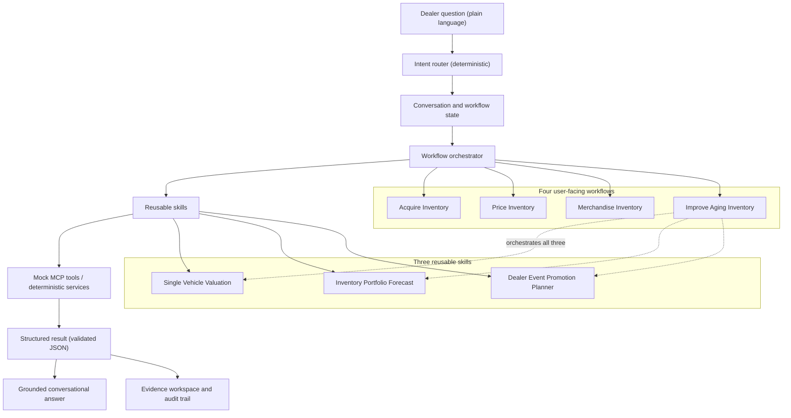

# Dealer AI Inventory Decision Assistant

A conversational prototype that helps used-vehicle dealers evaluate vehicle pricing, forecast
inventory, plan sales events, and take action on aging vehicles.

The assistant interprets a dealer's request and coordinates deterministic pricing and inventory
capabilities. It explains the validated results in dealer-friendly language, preserves human
approval, and retains the evidence and audit trail behind every recommendation.

> This is an independent prototype built with synthetic data and mock integrations. It is **not**
> a production Cox Automotive or vAuto product, and its outputs must not be used for real dealer
> pricing decisions.

---

## 1. What problem does this solve?

Used-vehicle dealers make inventory decisions that are hard to get right because the relevant
information lives in different places:

- **Pricing one vehicle** means balancing market position, profit margin, how long it has sat, and
  how quickly it is likely to sell — at once.
- **Portfolio decisions** ("should I buy more, and what?") depend on what the lot is likely to sell
  in the coming weeks and how much space and cash are tied up.
- **Promotion planning** works best when you pick the *right* vehicles for an event rather than
  discounting everything across the board.
- **Aging inventory** is the hardest case: deciding what to do with a car that has sat too long can
  span pricing, wholesale disposition, merchandising, incoming inventory pressure, and approval
  limits — several tools and several screens.

Most dealer tools show the data on separate screens and leave the person to connect the decision
by hand.

**The product hypothesis:** a conversational decision layer can interpret the dealer's intent,
coordinate existing pricing and inventory capabilities, and explain a recommended action — *without*
replacing the deterministic business logic that produces the numbers.

---

## 2. What can the tool do?

The tool is organized around four **workflows** — the jobs a dealer actually has. You can open a
workflow from the sidebar, or just ask the Assistant in plain words and it routes you.

| Workflow | A dealer would ask… | Decision it supports | Core capability |
| --- | --- | --- | --- |
| **Acquire Inventory** | "What can my lot absorb before I buy more?" | Capacity, inventory gaps, aging & replacement pressure | Inventory Portfolio Forecast |
| **Price Inventory** | "What should I price this vehicle?" | One-vehicle price vs market, margin, floor, and time to sale | Single Vehicle Valuation |
| **Merchandise Inventory** | "Plan Summer Clearance to reach 70% utilization." | Which vehicles to promote, protect, or exclude for an event | Dealer Event Promotion Planner |
| **Improve Aging Inventory** | "Which aging vehicles should I promote?" | End-to-end plan for the aged cohort | Coordinates all three capabilities |

### Acquire Inventory
Shows what the lot can hold and where the gaps are — capacity, open slots, aging pressure, and
incoming (inbound) inventory — so a dealer can see what to source next. *Appraising an external
purchase candidate is not implemented; this workflow reasons about vehicles already in inventory.*

### Price Inventory
Evaluates a **single vehicle**: current asking price, a recommended asking price, break-even, the
lowest safe asking price ("floor"), and expected time to sale — plus any approval or downside
conditions.

> Example: *"What should I price 2019 Jeep Wrangler SPORT?"*

### Merchandise Inventory
Turns a **named event** and an **inventory target** into a vehicle-level promotion plan: which
vehicles to include, which to protect or exclude, and how the plan trades off inventory velocity,
margin protection, and the likelihood of hitting the target. "Merchandise" here means deciding how
vehicles are *positioned and promoted* for an event — not writing advertising copy.

> Example: *"Plan Summer Clearance to reach 70% utilization."*

### Improve Aging Inventory
Diagnoses the lot, identifies aging candidates, and coordinates portfolio forecasting,
single-vehicle analysis, and promotion planning into one recommendation per vehicle — immediate
action, protection, wholesale / loss-minimization review, or potential event inclusion. **Improve
Aging is a multi-skill workflow, not a fourth independent calculation** — it runs the three skills
above in order and consolidates their results.

> Example: *"Which aging vehicles should I promote?"*

---

## 3. Quick product walkthrough

Improve Aging shows the product most clearly. A typical conversation:

1. **You ask:** *"Which aging vehicles should I promote?"*
   **The assistant** analyses the aging cohort, **names the actual vehicles**, separates *immediate
   action* from *no immediate action*, and — because no event is selected — states that promotion
   eligibility is *pending*.

2. **You ask:** *"Why is the BMW recommended for wholesale?"*
   **The assistant** explains from the existing result — days on lot, break-even, the safe floor,
   expected days to sale, the reason codes, and the review conditions. It does **not** re-run
   anything.

3. **You ask:** *"Use Summer Clearance."*
   **The assistant** re-runs the deterministic workflow *with the event*, and shows which vehicles
   become event candidates and the target likelihood — keeping the previous answer until the new one
   succeeds.

4. **You ask:** *"What should I price 2021 Honda Accord EX?"*
   **The assistant** recognizes this is a new pricing task, **switches** from Improve Aging to
   Single Vehicle Valuation, and preserves the earlier aging conversation and result in history.

The whole exchange stays in one thread; nothing you already saw disappears.

---

## 4. How to interpret the outputs

Plain-English meaning for the terms you'll see:

| Term | What it means |
| --- | --- |
| **Current asking price** | What the vehicle is listed at today. |
| **Recommended asking price** | The price the analysis suggests, given market and goals. |
| **Break-even price** | The price at which the sale neither makes nor loses money on paper. |
| **Lowest safe asking price** | The floor: the analysis will not recommend below this. |
| **Expected days to sale (P50)** | The central / median modeled time to sell — half the time it sells sooner, half later. |
| **Conservative days to sale (P90)** | A more cautious modeled case; it takes at least this long in roughly 9 of 10 modeled outcomes. Not a worst case, and not a guarantee. |
| **Days on lot** | How long the vehicle has already been in inventory. |
| **Lot-capacity utilization** | How full the lot is versus its capacity. |
| **Target likelihood** | A scenario-planning estimate of reaching a stated goal — an estimate, not a promise. |
| **Immediate action** | The vehicle needs a decision now (reprice, wholesale review, or manager review). |
| **No immediate action** | Analysed, but nothing is required now; it may become an event candidate. |
| **Protected / excluded** | Held back from action for a business or safety reason (recently acquired, already in a campaign, no safe discount room). |
| **Manager review** | The final action is a repricing that requires a manager to sign off. |
| **Review condition** | An individual underlying flag (e.g. "expected to sell below break-even") that contributes to a vehicle needing review. |
| **Wholesale / loss-minimization review** | A deeply aged, underwater vehicle to consider disposing of rather than holding. |
| **Promotion eligibility pending** | No event is selected yet, so which vehicles belong in a promotion is not finalized. |

A few things to keep in mind:

- **P50** is the central/median case; **P90** is a more conservative time-to-sale case.
- **Event inclusion does not guarantee a sale** — a plan improves the odds, it does not promise them.
- **Target likelihood is a scenario estimate**, not a commitment.
- **Every recommended action remains subject to dealer approval and policy.**

---

## 5. What makes this an AI product?

There are two distinct layers, and keeping them separate is the whole point.

**The conversational and orchestration layer** interprets what the dealer wants and coordinates the
work. It:
- interprets intent and routes to the right workflow,
- resolves vehicle and event references ("the BMW", "those two vehicles", "Summer Clearance"),
- coordinates the reusable skills,
- explains structured results in dealer language,
- keeps conversation context across turns,
- switches workflows when the dealer starts a new task, and
- asks for clarification when something is missing.

**The deterministic business services** produce every number: pricing, break-even, the safe pricing
floor, expected days to sale, holding-cost and depreciation exposure, inventory forecasting,
event-plan outcomes, and approval conditions.

> **The language model does not replace the pricing engine.** It interprets the request, calls
> existing capabilities, and explains their validated results.

In this prototype the conversational layer is **primarily deterministic** — routing, reference
resolution, filtering, and answer text are rules over the structured result, not model guesses. An
optional guarded-narration pattern exists for prose, and it is constrained so a model cannot state a
number the engine did not produce. Nothing about a price, forecast, or probability originates in a
model.

*(**MCP** = Model Context Protocol, a standard way for an assistant to call external tools and
systems. Here every MCP tool is **mocked** — see [section 9](#9-prototype-data-and-mcp-boundary).)*

---

## 6. Product architecture

The logical flow from a dealer's question to a grounded answer:



The distinction the diagram preserves: **workflows** are the four dealer-facing jobs; **skills** are
the three reusable capabilities underneath them. Acquire, Price, and Merchandise each lean on one
skill; **Improve Aging orchestrates all three**. A workflow is not a skill, and a skill is never a
menu item.

For the detailed design, see [`docs/architecture.md`](docs/architecture.md).

---

## 7. Conversation and workflow behavior

What the assistant does, turn by turn:

- **First-turn answers** give actual vehicle-level recommendations, not just a summary.
- **Follow-up explanations** read the active structured result (no re-run, no new numbers).
- **Follow-up filtering** ("show only vehicles over 90 days") selects existing rows — no re-run.
- **Event, target, and supported exclusion changes** re-run the deterministic workflow with the new
  input.
- **Failed re-runs preserve the previous valid result** — the prior answer is never lost.
- **A strong new business intent is evaluated before follow-up classification**, so a pricing
  request during an aging conversation **switches to Single Vehicle Valuation** rather than being
  answered as aging evidence. The *action verb* decides, not the vehicle name.
- **Prior workflow history is preserved** when a switch happens.

**Current boundary (be aware):**
- Multi-turn conversational depth is **strongest for Improve Aging**.
- Cross-workflow switching **to** Single Vehicle Valuation is implemented.
- Deep, valuation-specific follow-up conversation is **limited** — after a switch you see the
  valuation result and can start another request; a full valuation follow-up engine is future work.
- Not every workflow supports identical multi-turn behavior.

Design notes: [`docs/conversational-result-exploration-results.md`](docs/conversational-result-exploration-results.md),
[`docs/conversational-follow-ups-results.md`](docs/conversational-follow-ups-results.md),
[`docs/cross-workflow-intent-switching-results.md`](docs/cross-workflow-intent-switching-results.md).

---

## 8. Safety, governance, and human control

The prototype is built as if it were an enterprise assistant that must stay inside the dealer's
control:

- **No automatic price publishing.** Nothing here writes a price to any system.
- **Human-in-the-loop approval.** Every recommendation is decision support a manager reviews.
- **Vehicle-level review counts** in the dealer-facing view keep decisions clear and actionable.
- **Raw review-condition records are retained for audit**, not shown as separate approvals.
- **Request IDs and simulation IDs** trace every figure back to the run that produced it.
- **Deterministic calculations** — the numbers are reproducible, not model output.
- **Grounded answers** — chat text is built from the structured result.
- **Unsupported-data requests are refused** rather than answered with an invented value.
- **Failed re-runs recover** to the previous valid result.
- **Protected and excluded vehicles** are held back explicitly, with a reason.
- **No silent override** of an approval or pricing boundary.

**Two views, one truth:**
- **Dealer-facing view** — unique affected vehicles and the decisions to make.
- **Audit view** — raw review conditions, reason codes, request IDs, simulation IDs, and the
  execution trace.

**Presentation principle (example from the current synthetic scenario):** a line like *"5 vehicles
require review"* is the dealer-facing decision count. The underlying review conditions (in that
scenario, more numerous than the vehicles) remain available in **"View approval details"** and are
**not** presented as separate approval actions. The specific counts are an artifact of the synthetic
data, not a fixed product rule.

More: [`docs/improve-aging-count-reconciliation-results.md`](docs/improve-aging-count-reconciliation-results.md),
[`docs/approval-policy.md`](docs/approval-policy.md).

---

## 9. Prototype data and MCP boundary

- The prototype uses **synthetic vehicle and dealer data** — a 12-vehicle mock dealership.
- **MCP integrations are mocked.** MCP (Model Context Protocol) is the pattern an enterprise
  assistant would use to call existing pricing, inventory, market-data, and workflow services. Here
  those calls are served from local fixtures under [`mocks/`](mocks/).
- **No live data** from Cox, vAuto, KBB, Autotrader, a DMS, a dealership, consumers, leads, vehicle
  detail page (VDP) views, or any transaction is used.
- **Outputs must not be used for real dealer pricing decisions.**

**What is demonstrated vs. what production would require:**

| Demonstrated here | A production implementation would additionally need |
| --- | --- |
| Deterministic pricing/forecast/promotion services over synthetic data | Live inventory and market-data integrations |
| Mock MCP tool calls | Authenticated dealer context, permissions, and entitlements |
| Grounded, auditable conversational answers | Production model validation, evaluation, and monitoring |
| Reproducible, seeded simulation | Observability, cost controls, and rollback / fallback behavior |
| No price publishing | Privacy/security reviews and policy configuration |

None of the production items above is implemented; they are listed to be explicit about the gap.
The MCP contract this prototype models is described in
[`docs/vauto-mcp-contract.md`](docs/vauto-mcp-contract.md).

---

## 10. Getting started

**Prerequisites:** Python 3.11 or newer.

```bash
# clone
git clone <your-fork-url>
cd Pricing_demo

# create and activate a virtual environment
python -m venv .venv
# macOS / Linux:
source .venv/bin/activate
# Windows (PowerShell):
.venv\Scripts\Activate.ps1

# install dependencies (editable install puts the package on the path)
pip install -r requirements.txt
pip install -e .

# run the app — the correct entry point is app.py
streamlit run app.py
```

Streamlit prints the local URL when it starts (by default `http://localhost:8501`) and opens it in
your browser.

An `ANTHROPIC_API_KEY` is **optional**. Without one, natural-language intake uses a recorded
extraction and any narration falls back to a deterministic template built from the computed values —
so it degrades rather than breaking, and the UI says which is in use.

**Use `app.py`.** If you see an untracked experimental file such as `spike_navigation.py`, do not
run it — it is not part of the supported application.

**Restarting after a code change.** Streamlit's in-app *Rerun* re-runs the page script but keeps
already-imported modules cached in the running process, so deep logic changes may not take effect.
After pulling Python changes:

1. Stop the server (**Ctrl+C** in its terminal).
2. Start it again with `streamlit run app.py`.
3. If the browser still looks stale, hard-refresh (Ctrl+Shift+R) or open a new tab.

---

## 11. Example prompts

**Acquire Inventory**
- "What inventory should I acquire?"

**Price Inventory**
- "What should I price 2019 Jeep Wrangler SPORT?"

**Merchandise Inventory**
- "Plan Summer Clearance to reach 70% utilization."

**Improve Aging Inventory**
- "Which aging vehicles should I promote?"

**Follow-ups (after an Improve Aging answer)**
- "Why is the BMW recommended for wholesale?" — *explains from the existing result (no re-run)*
- "Show only vehicles over 90 days." — *filters the existing result (no re-run)*
- "Which vehicles have safe promotional room?" — *filters using existing reason codes*
- "Use Summer Clearance." — *re-runs the deterministic workflow with the event*
- "What should I price 2021 Honda Accord EX?" — *switches to Single Vehicle Valuation*

---

## 12. Testing and validation

```bash
python -m pytest tests -q            # unit + integration tests
python scripts/validate_schemas.py   # JSON Schema, reference, fixture, and scenario checks
```

Run the commands above for the current totals. As of this commit: **534 tests pass** and **62 schema
checks pass**. (`scripts/validate_structure.ps1` runs the subset that needs no Python.)

At a high level the tests cover: workflow routing, deterministic calculations, grounded first-turn
answers, approval presentation, multi-turn conversation state, filtering without re-run, re-run
state preservation, unsupported-data refusal, cross-workflow switching, and the JSON Schema
contracts. An architecture test also asserts that the calculation layer cannot import a model or the
network, so a number can never originate in the language model.

---

## 13. Repository map

| Path | What it is |
| --- | --- |
| [`app.py`](app.py) | Application entry point — builds the sidebar from the workflow registry. |
| [`src/pricing_agent/agents/`](src/pricing_agent/agents/) | Deterministic router, vehicle/event resolution, conversation state, follow-up handling, and workflow switching. |
| [`src/pricing_agent/workflows/`](src/pricing_agent/workflows/) | Dealer-workflow registry and the Improve Aging orchestration. |
| [`src/pricing_agent/skills/`](src/pricing_agent/skills/) | The three reusable capabilities the workflows call. |
| [`src/pricing_agent/views/`](src/pricing_agent/views/) | Streamlit render functions (views render results; they never calculate). |
| [`mocks/`](mocks/) | Synthetic dealer data and mock MCP tool responses. |
| [`schemas/`](schemas/) | 18 JSON Schemas (draft 2020-12) that every result is validated against. |
| [`tests/`](tests/) | Unit, schema, and integration tests, plus scenario definitions. |
| [`docs/`](docs/) | Architecture, methodology, MCP contract, policy, and per-feature design notes. |

Deeper calculation modules (`simulation/`, `domain/`, `policy/`, `config/`, `mcp_clients/`) live
under `src/pricing_agent/`; see [`docs/architecture.md`](docs/architecture.md).

---

## 14. Current limitations

- **Synthetic data only** — a 12-vehicle mock dealership.
- **Mock MCP integrations** — no live market or system feeds.
- **No VDP, lead, CRM, or shopper-conversion data**, and the assistant refuses questions that would
  require it.
- **No automatic price publishing.**
- **Multi-turn depth is strongest in Improve Aging**; other workflows are largely single-turn.
- **Valuation follow-up depth is limited** after a cross-workflow switch.
- **Intent classification is a conservative deterministic classifier** — novel phrasings fall back
  to a clarification question rather than a guess.
- **Workflow re-run inputs are limited** to event, target, and supported vehicle exclusions.
- **No production identity, permissions, or entitlement layer.**
- **Not validated for real financial decisions.**
- **Forecasts are a configured simulation, not a trained model** (every output is labeled
  `CONFIGURABLE_PROTOTYPE_SIMULATION`), and some inputs — notably price elasticity — are configured,
  not calibrated. See [`docs/open-questions.md`](docs/open-questions.md).

---

## 15. Product evolution

How the assistant grew, and where it could go next:

1. Workflow-specific tools (four dealer workflows over three skills)
2. Natural-language routing to the right workflow
3. Grounded first-turn answers that name actual vehicles
4. Multi-turn result exploration (explain, filter)
5. Validated workflow re-runs (event, target, exclusions)
6. Cross-workflow intent switching (Improve Aging → Single Vehicle Valuation)

**Future opportunities (not implemented):**
- generalized conversation adapters so more workflows get the same multi-turn depth,
- first-class plan comparison ("what changes with the Balanced plan?"),
- an optional guarded LLM phrasing layer over the deterministic answers,
- live enterprise integrations (inventory, market data, identity), and
- an evaluation, observability, and governance harness.

These are directions, not delivered features.

---

## 16. Disclaimer

This is an **independent prototype**. It runs entirely on **synthetic data** and **mock services**.
It is **not affiliated with, endorsed by, or connected to** Cox Automotive, vAuto, Kelley Blue Book
(KBB), or Autotrader. Trademark names appear only to describe the kind of system this prototype
models. It is **not for production pricing or dealer decision-making**.
